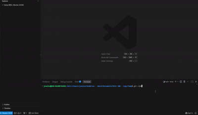
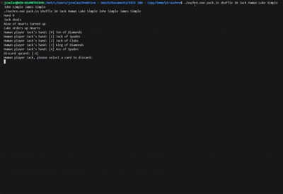
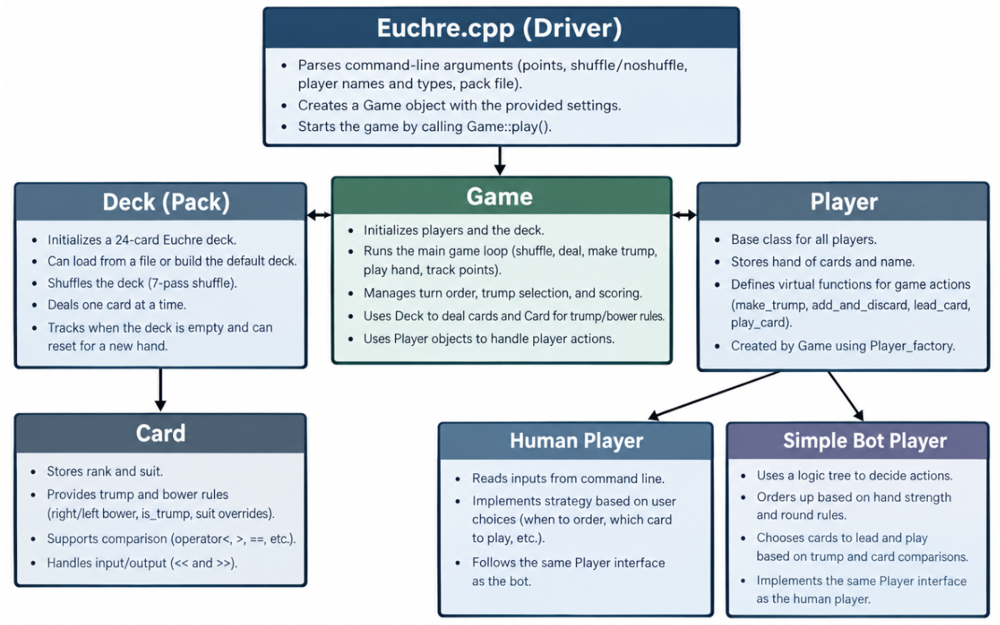
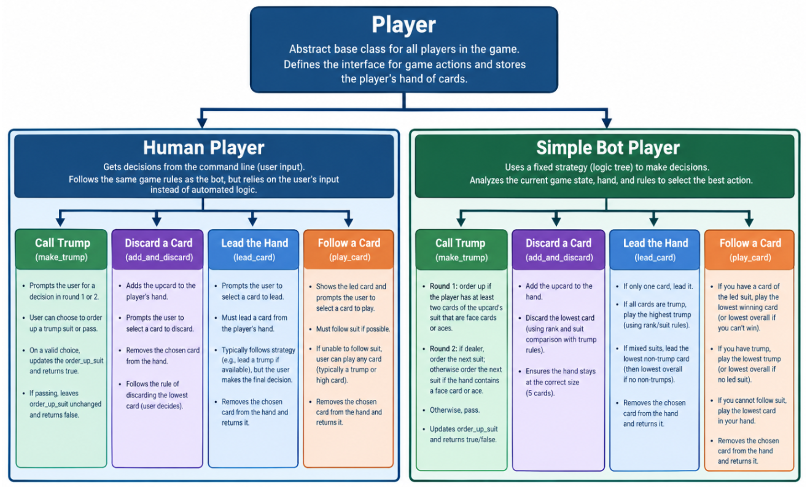

# Euchre Project — EECS 280 Project 3

A C++ implementation of Euchre, a card game commonly played in the Midwest.

## Table of Contents

- [Project Description](#project-description)
  - [What Is Euchre?](#what-is-euchre)
  - [What Does This Project Do?](#what-does-this-project-do)
  - [Why Does This Project Exist?](#why-does-this-project-exist)
- [Quickstart Guide](#quickstart-guide)
  - [Requirements](#requirements)
  - [Building the Project](#building-the-project)
  - [Running the Project](#running-the-project)
- [Feature Highlight: Automated Players](#feature-highlight-automated-players)
- [Architecture](#architecture)
- [Usage Examples](#usage-examples)
- [Frequently Asked Questions](#frequently-asked-questions)

## Project Description

### What Is Euchre?

Euchre is a four-player card game commonly played in the Midwest. The goal is to score 10 points by winning hands.

Each hand consists of five tricks. The team that wins the majority of the tricks wins the hand. The game is played by two teams of two, with players alternating between teams around the table.

The leader of each trick is:

- The player to the left of the dealer for the first trick
- The winner of the previous trick for each subsequent trick

Players must follow the lead suit when possible. If a player cannot follow suit, they may play any other card.

The trump suit is selected at the beginning of each hand. Trump cards rank higher than cards from all non-trump suits. The jack of the trump suit, known as the **right bower**, is the highest-ranking card in the game.

### What Does This Project Do?

This project provides a terminal-based version of Euchre. One or more people can play using any combination of human and computer-controlled players.

The project is organized around four main abstractions:

- **Player:** Handles human actions and automated player behavior
- **Card:** Represents cards and compares their relative values
- **Pack:** Handles the Euchre deck, including shuffling and dealing
- **Game:** Controls the overall game flow

### Why Does This Project Exist?

This program is the third of five projects in **EECS 280: Programming and Introductory Data Structures**. It provides a fun, interactive way to play Euchre without physical cards while demonstrating object-oriented programming, polymorphism, and data abstraction in C++.

## Quickstart Guide

### Requirements

Before building the project, make sure you have:

- A C++ compiler
- A terminal or command-line environment
- Git
- A cloned copy of the Euchre project repository

### Building the Project

First, clone the repository and change into the newly created directory:

```bash
git clone https://github.com/ammarateya/p3-euchre
cd p3-euchre
```

Build the project using the preconfigured Makefile:

```bash
make clean
make
```

> 

### Running the Project

The program accepts command-line arguments that define the pack, shuffle setting, winning score, player names, and player types.

```bash
./euchre.exe [pack] [shuffle] [points] \
  [p1] [p1_type] \
  [p2] [p2_type] \
  [p3] [p3_type] \
  [p4] [p4_type]
```

#### Arguments

- **`[pack]`**: The input pack file to use
- **`[shuffle]`**: Whether to shuffle the pack
- **`[points]`**: The number of points needed to win
- **`[p1]` through `[p4]`**: The in-game names of the players
- **`[p1_type]` through `[p4_type]`**: Each player's type, either `Human` or `Simple`

> 

## Usage Examples

### One Human Player and Three Bots

The following command starts a game with one human player named Jack and three `Simple` computer-controlled players:

```bash
./euchre.exe pack.in shuffle 10 \
  Jack Human \
  Luke Simple \
  John Simple \
  James Simple
```

### Four Human Players

The following command starts a game with four human players:

```bash
./euchre.exe pack.in shuffle 10 \
  Jack Human \
  Luke Human \
  John Human \
  James Human
```

## Feature Highlight: Automated Players

One of the project's key features is support for any combination of automated and human players.

The `Simple` player is a basic computer-controlled player that can play against you and your friends. It is useful for beginners learning the game or for groups that do not have enough people for a four-player game.

A `Simple` player can:

- Decide whether to call a trump suit
- Select a card to discard after picking up the upcard
- Select a card when leading a trick
- Select a legal card when following another player

The player makes decisions using thresholds based on face cards, trump cards, and suit counts.

### Calling Trump

During the first round of ordering up trump, the bot counts the face cards in its hand that would become trump cards. If it has at least two, it orders the dealer to pick up the upcard.

During the second round, the bot considers the other suit that is the same color as the upcard. If it has at least one face card in that suit, it calls that suit as trump.

If the bot is the dealer and is forced to choose a suit under the **stick-the-dealer** rule, it always calls the other suit of the same color as the upcard.

### Selecting a Card to Discard

If the bot is the dealer and picks up the upcard, it must discard one card to keep its hand at five cards.

The bot calculates the relative value of each card and discards the lowest-value card, which is usually its lowest non-trump card. This maximizes the strength of the remaining hand.

### Leading a Trick

The bot uses the following strategy when leading a trick:

1. If every card in its hand is a trump card, it leads with its highest trump card.
2. If it has any non-trump cards, it leads with its highest non-trump card.

This follows the general strategy of leading a strong off-suit card while preserving trump cards for later tricks.

### Following in a Trick

When following another player's lead, the bot must follow the lead suit if possible.

- If the bot can follow suit, it plays its highest card of that suit.
- If the bot cannot follow suit, it plays its lowest-value card.

The bot also accounts for the **left bower**—the jack of the suit that is the same color as the trump suit. The left bower is treated as a trump card rather than as a card from its printed suit.

Correctly handling the left bower is essential. Otherwise, the bot might illegally play another card when it is required to follow trump.

Together, these decision-making rules create a simple computer-controlled player that can teach, challenge, or fill in for human players.

## Architecture

The project is separated into four main C++ abstractions:

- `Game`
- `Pack`
- `Card`
- `Player`

> 

### Game

The `Game` component controls the overall operation of the game, including:

- Creating and maintaining players
- Tracking the score
- Rotating the dealer
- Managing hands and tricks
- Determining when the game ends

### Pack

The `Pack` class stores the 24-card Euchre deck and handles operations related to:

- Reading cards from an input file
- Shuffling the deck
- Dealing cards
- Resetting the pack

### Card

Each `Card` object represents one of the 24 cards in a Euchre deck.

The `Card` class stores:

- The card's rank
- The card's suit

It also uses overloaded operators and comparison functions to determine which cards have higher priority.

The class handles game-specific rules involving:

- The trump suit
- The right bower
- The left bower
- The lead suit

### Player

The `Player` abstraction represents one of the four players in the game. It has two primary implementations:

- `SimplePlayer`
- `HumanPlayer`

#### Simple Player

The `SimplePlayer` is a computer-controlled player that uses a basic decision tree to play automatically when fewer than four human players are available.

#### Human Player

The `HumanPlayer` represents a person playing the game through the terminal. The program prints available commands and card choices while enforcing the rules of Euchre, including the requirement to follow suit.

> 

## Frequently Asked Questions

### Do I need four human players to play?

No. You can use any combination of human and `Simple` players.

For example, you can play with:

- Four human players
- One human player and three bots
- Two human players and two bots
- Four bots

A four-bot game can be useful for reading through an automated game's history and learning the rules.

### What is the purpose of the shuffle argument?

The shuffle argument determines whether the deck is shuffled when the game runs.

Developers can disable shuffling while debugging so the cards appear in a predictable order. This makes program behavior easier to reproduce and trace across multiple runs.

### Why does the program accept an input deck?

A static input deck lets developers reproduce specific game states and test particular conditions.

For example, a developer can construct a deck that tests:

- Trump selection
- Bower behavior
- Following suit
- Trick resolution
- Scoring
- Dealer rotation

Using the same input deck across multiple runs makes debugging and testing more predictable.
